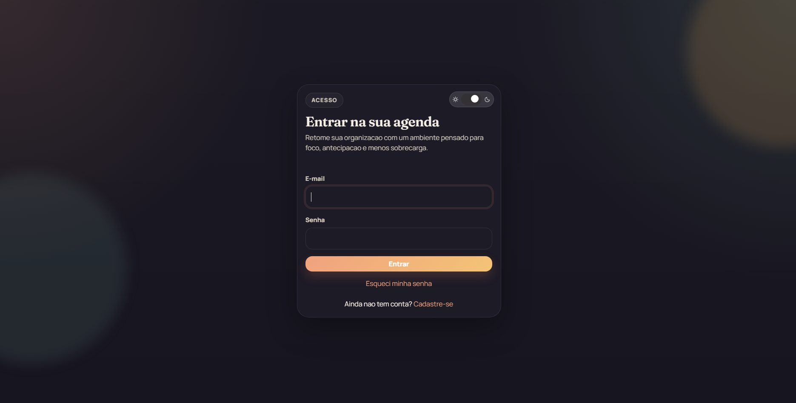
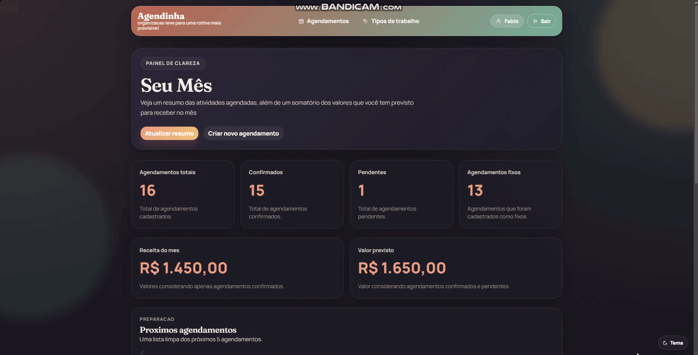
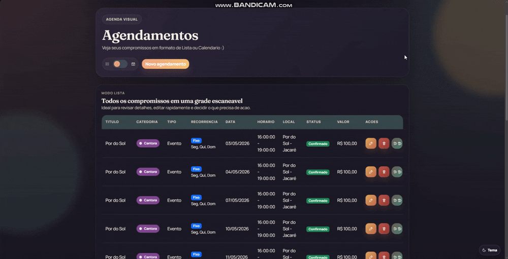
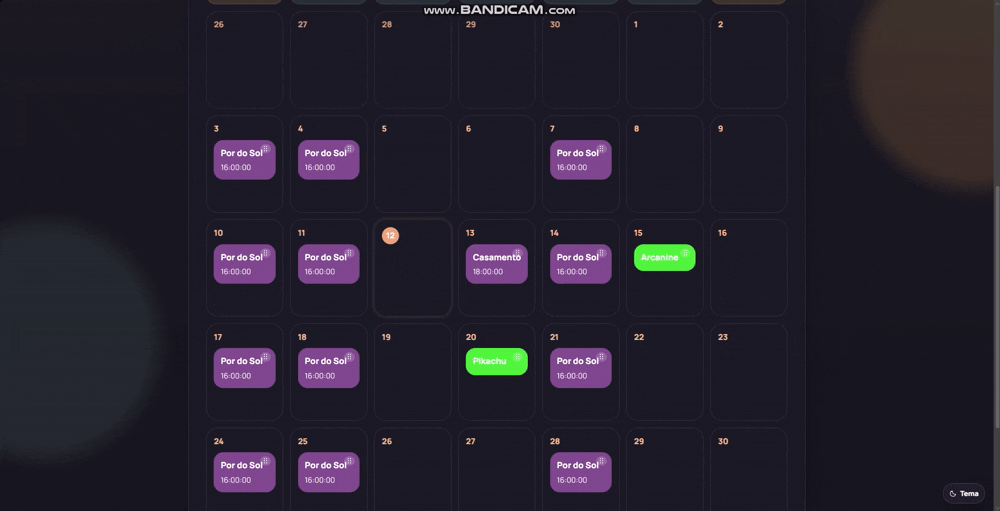
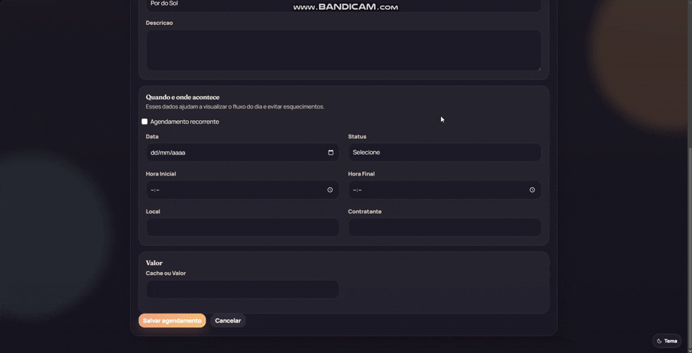

# AgendaFlow

Sistema de agendamentos com categorias visuais, dashboard e controle de eventos. 

Pensado em uma usuária que trabalha com diferentes tipos de trabalho ao longo do mês e que enfrentava dificuldades em organizar seus horários assim como seu financeiro. 

O projeto contem sistema de cadastro de agendamentos, onde se preenche o tipo de trabalho(cadastrado previamente), data, nome do contratante daquele serviço, local e valor a ser recebido por aquele trabalho. Pode ser adicionado agendamentos avulsos ou o mesmo agendamento de forma recorrente ao longo de um período pre definido, para o caso de, por exemplo, um trabalho onde ela irá no mesmo horário nos mesmos dias da semana do dia x até o dia y.

## Preview

## Login

## Dashboard

## Lista / Calendario

## Ajustar Agendamentos no Calendário

## Cadastro(Recorrente ou Fixo)

